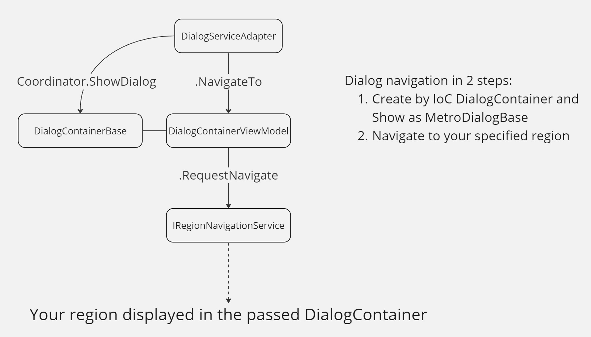

# Prismetro


## TODO

- [ ] Сворачивание окон (`Freezing`) (без очистки вью моделей и с возможностью отслеживать результат)
- [x] Модификация `DialogContainerView` (Добавить `DialogContainerCore`)
- [x] Правила валидации (`ValidationRule`) (???)
- [ ] В этом же проекте (отдельной сборке) можно написать клавиатуры. +Отдельный модуль для совместимости с `DialogService`

## Startup

1. Добавьте сборку `Prismetro.Core` в ваш проект.
2. Зарегистрируйте сборку в проекте, используя `ContainerRegistryExtensions`. В качестве аргумента передайте окно приложения:

```C#
public partial class App
{
    protected override void RegisterTypes(IContainerRegistry registry)
    {
        registry.AddPrismetro(() => Current.MainWindow!);
    }

    protected override Window CreateShell() => Container.Resolve<MainWindow>();
}
```

3. Чтобы начать использовать навигацию по вашим регионам, создайте какую-нибудь `ViewModel` и `View`. `ViewModel` должна унаследоваться от `INavigationDialogAware` или `INavigationDialogAware<TResult>` (если диалог должен вернуть какой-либо результат) зарегистрируйте их следующим образом:

```C#
registry.RegisterForNavigation<YourView, YourViewModel>("YourRegion");
```

4. Используйте:

```C#
var dialogService = ContainerLocator.Container.Resolve<IDialogServiceAdapter>();
using var scope = await _dialogService.ShowDialogAsync(new Navigate("YourRegion", new()));

// Some work...
Task.Delay(2000).ContinueWith(_ => scope.RequestClose());
```

